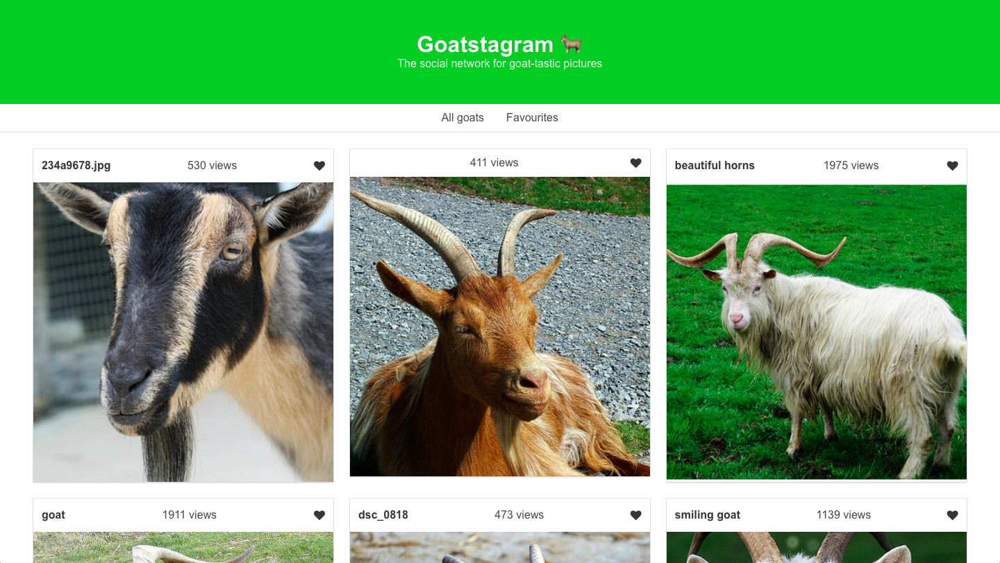
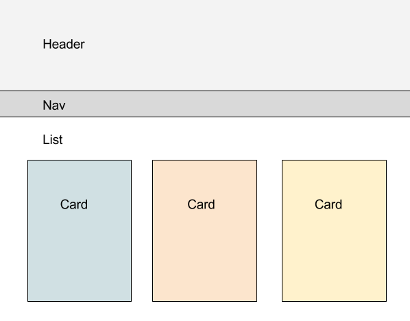

# AO.com Tech Challenge

My own interpretation of the AO.com challenge: create an image-based SPA that
allows you to like / unlike photos from Flickr.



## Quick start (browse a hosted version from Heroku)

[Follow this link](http://ao-tech-challenge.herokuapp.com/)

## Thoughts & designs

I chose the Instagram style layout because it matched the styles of the deals
page at the time (Black Friday).

Like the deals page, the SPA layout starts out as a grid of 3 cards per row,
shrinking to two on tablets and one on mobile.

### Drawing out the components



The end result had a few refactors and I've ended up with 5 presentational
components and one container component

### The Data

Data is coming from a signed Flickr API call loaded into the app through
environment variables:

https://api.flickr.com/services/rest/?method=flickr.photos.search&api_key=XXXXXXXXXX&user_id=&tags=animals&text=goats&sort=relevance&safe_search=&content_type=1&place_id=&media=&extras=url_m%2C+views&format=json&nojsoncallback=1

The method used was flickr.photo.search, because it returned the most relevant
results paired with:

* tags: animals, goats
* sort: relevance
* content_type: 1 (just photos)
* extras: url_m (medium sized image link), views

### The Application Data

App data is handled by Redux with a very simple set of actions and reducers.
Most of the unit testing had been done on the Redux, after all the data dictates
changes to the UI.

The redux store mainly contains the photosData object which branches into photos
and favourites. An action populated main photosData.

The app allow a visitor to quickly favourite a photo, which triggers another set
of actions that either remove the photo from state and adds it to favourites or
vice versa.

### Routing

Routing is done using React Router v4 and it covers two routes: '/' and
'/favourites'.

Routing caused some problems because the app required a container component to
render parent which in turn would render a list with two different props.
Routing v4 always seems to be awkward because there's a shortage of well written
guides out there and the big changes in architecture.

### Persistent storage

I was debating between a library and a custom solution and choose to write the
function myself. You can find it in localStorage.js and the function makes use
of the localStorage api.

This tackles the challenge of persisting favourites after page refresh.

```javascript
export const loadState = () => {
  try {
    const serializedState = localStorage.getItem("state");
    if (serializedState === null) {
      return undefined;
    }
    return JSON.parse(serializedState);
  } catch (err) {
    return undefined;
  }
};

export const saveState = state => {
  try {
    const serializedState = JSON.stringify(state);
    localStorage.setItem("state", serializedState);
  } catch (err) {
    // Ignore write errors
  }
};
```

### CSS and styling

For speed considerations I decided to use bulma for styling, a css framework
that uses Flexbox. What I gained in speed I lost in bloat, so to get rid of
redudant code I used Sass to only load the components I needed and edit the
framework default variables.

Made use of Font Awesome for icons and Sass again to custom load the components.

### Code quality

I'm a big fan of the Airbnb Javascript style guide so I used their linting
packages alongside Prettier, a code formater. The linting plugin also include
a11y accesibility rules. Further accesibility considerations went into the
dynamic Title tag swapping between the two routes of the app.

Husky was use to run tests and linting before every test.

### Avoiding the rerender of favourite items

Took me a bit to get my head around this but using a nested filter we can check
the incoming action playload by the existing favourites and we can remove the
intersecting items.

```javascript
newState.data = action.payload.photos.photo.filter(
  photosElem =>
    newState.favourites.filter(favElem => favElem.id == photosElem.id).length ==
    0
);
```

## Slow start (dowload the app)

These instructions will get you a copy of the project up and running on your
local machine for development and testing purposes.

### Prerequisites

#### node.js

node.js must be installed on your machine (any versions will work; v7.10.0 was
used for this project)

```
$ node -v // v7.10.0
```

To install node follow this guide -
https://nodejs.org/en/download/package-manager/#osx

#### npm

npm is required (any versions will work; v4.2.0 was used for this project)

```
$ npm -v // 4.2.0
```

To install npm follow this guide -
https://docs.npmjs.com/getting-started/installing-node

#### Install

Clone the repo and install the app using this command

```
npm i
```

### Start the app

The app was built using the create-react-app scripts for easier deployment to
Heroku

To start the app run the start script

```
$ npm start
```

## Running the tests

The tests are built using Jest and moxios for mocking requests.

To run the tests, type the following command in your terminal anywhere withing
the project folder

```
$ npm t
```

The tests available:

* actions.test
* photos.reducer.test

### Actions Testing patterns

fetchPhotosFailed() SYNC action

```javascript
describe("fetchPhotosFailed ", () => {
  test("returns 'FETCH PHOTOS FAILED' and payload", () => {
    const err = {
      err: "I am an error!"
    };
    expect(actions.fetchPhotosFailed(err)).toEqual({
      type: "FETCH PHOTOS FAILED",
      payload: err
    });
  });
});
```

fetchPhotos() ASYNC action

```javascript
describe("fetchPhotos ASYNC", () => {
  beforeEach(() => {
    moxios.install();
  });

  afterEach(() => {
    moxios.uninstall;
  });
  test("adds payload to an empty store", () => {
    moxios.wait(() => {
      const request = moxios.requests.mostRecent();
      request.respondWith({
        status: 200,
        response: {
          photos: {
            photo: [
              {
                id: "35057169673",
                title: "GOAT",
                views: "1109",
                url_m:
                  "https://farm5.staticflickr.com/4288/35057169673_7610627c7e.jpg"
              },
              {
                id: "9117768351",
                title: "Goat (1)",
                views: "10267",
                url_m:
                  "https://farm6.staticflickr.com/5502/9117768351_a1121f1791.jpg"
              }
            ]
          }
        }
      });
    });

    const store = mockStore({
      items: []
    });

    const expectedActions = [
      { type: types.FETCH_PHOTOS_REQUEST },
      {
        type: types.FETCH_PHOTOS_SUCCESS,
        payload: {
          photos: {
            photo: [
              {
                id: "35057169673",
                title: "GOAT",
                views: "1109",
                url_m:
                  "https://farm5.staticflickr.com/4288/35057169673_7610627c7e.jpg"
              },
              {
                id: "9117768351",
                title: "Goat (1)",
                views: "10267",
                url_m:
                  "https://farm6.staticflickr.com/5502/9117768351_a1121f1791.jpg"
              }
            ]
          }
        }
      }
    ];
    return store.dispatch(actions.fetchPhotos()).then(() => {
      expect(store.getActions()).toEqual(expectedActions);
    });
  });
});
```

### Reducers Testing patterns

fetchPhotos() photos.reducer.js

```javascript
 describe('fetchPhotos', () => {
    test('adds a collection of photos to an empty state', () => {
      const action = actions.fetchPhotosSuccess({
        photos: {
          photo: [
            {
              id: '35057169673',
              title: 'GOAT',
              views: '1109',
              url_m:
                'https://farm5.staticflickr.com/4288/35057169673_7610627c7e.jpg'
            },
            {
              id: '9117768351',
              title: 'Goat (1)',
              views: '10267',
              url_m:
                'https://farm6.staticflickr.com/5502/9117768351_a1121f1791.jpg'
            }
          ]
        }
      });
      const newState = reducer(initialState, action);
      expect(Array.isArray(newState.data)).toBe(true);
      expect(newState.data).toEqual([
        {
          id: '35057169673',
          title: 'GOAT',
          views: '1109',
          url_m:
            'https://farm5.staticflickr.com/4288/35057169673_7610627c7e.jpg'
        },
        {
          id: '9117768351',
          title: 'Goat (1)',
          views: '10267',
          url_m: 'https://farm6.staticflickr.com/5502/9117768351_a1121f1791.jpg'
        }
      ]);
      expect(newState).not.toMatchObject(initialState);
    });
```

## File Structure

```
├── README.md
├── out.txt
├── package.json
├── public
|  ├── goat_apple_emoji.png
|  ├── index.html
|  └── manifest.json
├── src
|  ├── Routes.js
|  ├── actions
|  |  ├── actions.js
|  |  ├── actions.test.js
|  |  └── types.js
|  ├── components
|  |  ├── App.js
|  |  ├── AppContainer.js
|  |  ├── Header.js
|  |  ├── Nav.js
|  |  ├── PhotoCardMini.js
|  |  └── PhotoList.js
|  ├── css
|  |  ├── config.rb
|  |  ├── sass
|  |  |  └── main.scss
|  |  └── stylesheets
|  |     └── main.css
|  ├── index.js
|  ├── localStorage.js
|  ├── reducers
|  |  ├── index.js
|  |  ├── photos.reducer.js
|  |  └── photos.reducer.test.js
|  └── registerServiceWorker.js
├── static.json
└── task.md
```

## Built With

### Dependencies

* [Prop-types](https://www.npmjs.com/package/prop-types) - React prop type
  validation
* [React](https://www.npmjs.com/package/react) - JS library for building UIs
* [React DOM](https://www.npmjs.com/package/react-dom) - React package for
  working with the DOM
* [React Redux](https://www.npmjs.com/package/react-redux) - React bindings for
  Redux
* [React Router DOM](https://www.npmjs.com/package/react-router-dom) - DOM
  bindings for React Router v4
* [React Router Redux](https://www.npmjs.com/package/react-router-redux) - Redux
  bindings for React Router
* [Redux](https://www.npmjs.com/package/redux) - State container for React Apps
* [Redux Logger](https://www.npmjs.com/package/redux-logger) - Logger for Redux
* [Bulma](https://www.google.co.uk/search?client=safari&rls=en&q=bulma&ie=UTF-8&oe=UTF-8&gfe_rd=cr&dcr=0&ei=mewgWueDH4mJgAbMk4GgCw) -
  a modern CSS framework built on Flexbox
* [History](https://www.npmjs.com/package/history) -a JavaScript library that
  lets you easily manage session history anywhere JavaScript run
* [Font Awesome](http://fontawesome.io) - Font and CSS toolkit
* [Node UUID](https://www.npmjs.com/package/uuid) - Simple, fast generation of
  RFC4122 UUIDS.

### Dev Dependencies

* [Husky](https://github.com/typicode/husky) - Git hooks made easy, used to
  chain linting and tests before commits
* [Jest](https://facebook.github.io/jest/) - Javascript Testing solution
* [ESLint + JSX, React, Jest plugins](http://eslint.org) - Linting utility
* [Prettier](https://www.npmjs.com/package/prettier) - Code formater, used to
  enforce linting at save

## Authors

* **Alan Ionita** - https://github.com/alanionita

## Acknowledgments

React, Redux, and the magical webpack 🙌
